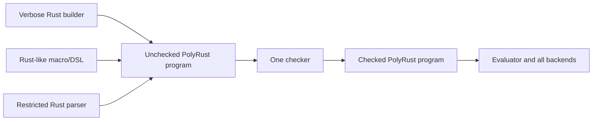
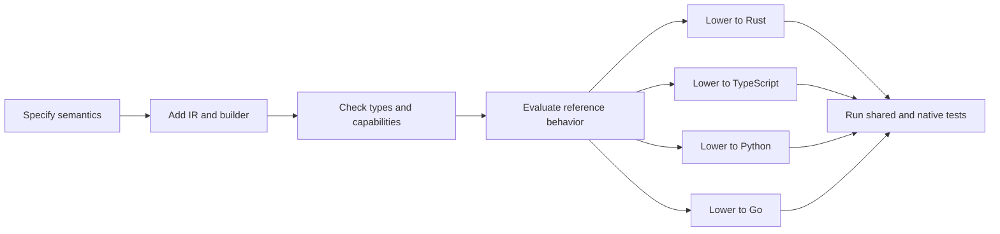

# PolyRust portable language map

Status: proposed capability roadmap

## Product model

PolyRust defines one extensible, language-neutral programming model. Authors use
a Rust builder API to declare types, constants, functions, implementations, and
tests. PolyRust validates and executes that model, then each backend renders it as
native Rust, TypeScript, Python, or Go.

PolyRust does not ingest existing Rust, TypeScript, Python, or Go programs and
does not translate between pairs of source languages.

```mermaid
flowchart LR
    A["Rust generator program"] --> B["PolyRust program model"]
    B --> C["Type checker"]
    C --> D["Reference evaluator"]
    C --> E["Rust backend"]
    C --> F["TypeScript backend"]
    C --> G["Python backend"]
    C --> H["Go backend"]
    B --> T["Portable test declarations"]
    T --> D
    T --> E
    T --> F
    T --> G
    T --> H
```



The program model is the product. The Rust builder is how authors construct it;
the generated Rust backend is one of its outputs.

## Authoring evolution

The initial Rust API can be intentionally verbose because it exposes every
semantic decision and makes the program model easy to debug:

```text
ModuleBuilder → declarations → checked expressions → portable tests → finish
```

Later authoring forms MAY lower into the exact same unchecked program model:



Recommended progression:

| Authoring form | When | Contract |
| --- | --- | --- |
| Verbose typed builder | Core | Reference authoring API; can express every supported node explicitly |
| Rust-like `poly!` syntax or attributes | After the model stabilizes | Convenient syntax that only represents mapped PolyRust functionality |
| Restricted ordinary-Rust parser | Later | Accepts a documented subset and rejects every construct without a PolyRust meaning |

All authoring forms MUST produce the same unchecked IR and use the same checker.
No parser can inject checked nodes, target syntax, or backend-specific behavior.
Parsing Rust syntax does not by itself supply Rust's name resolution, trait
solving, macro behavior, ownership semantics, or library behavior; supported
constructs must still be lowered according to the portable language map.

This is one-to-many code generation with several possible authoring syntaxes, not
source-language-to-source-language translation.

## Roadmap legend

| Stage | Meaning |
| --- | --- |
| **Core** | Required for the first useful four-language vertical slice |
| **Next** | Add after Core conformance is reliable |
| **Later** | Valuable, but needs a larger semantic design |
| **Adapter** | Platform effect supplied explicitly per target |
| **Excluded** | Intentionally absent unless a future specification overturns the decision |

Moving a feature to Core requires one target-independent definition, checker and
evaluator support, all four backend lowerings, generated native tests, and shared
conformance cases.

## 1. Declaration map

| Construct | Stage | Portable meaning | Important constraints |
| --- | --- | --- | --- |
| Package/module | Core | Namespace and generated artifact boundary | No arbitrary target imports |
| Constant | Core | Public or private immutable module value | May lower to native const, static/lazy value, or accessor |
| Type alias | Core | Alternative name for a type | No recursive aliases |
| Newtype/opaque type | Next | Distinct nominal wrapper around one value | Explicit construction and unwrapping |
| Record | Core | Named immutable product type with fields | Structural value semantics |
| Tagged enum | Core | Closed sum type with unit or record-shaped variants | Exhaustive matching |
| Contract/interface | Core | Named abstract behavior with required method signatures | Restricted contract views described below |
| Read-only contract property | Next | Abstract getter with no exposed storage assumption | May lower to a property or zero-argument method |
| Contract implementation | Core | Explicit record-to-contract conformance plus method bodies | Exactly one implementation per record/contract pair in Core |
| Top-level function | Core | Pure named callable | No overloading or recursion in Core |
| Record method | Core | Pure function with immutable `self` | No mutation or target-specific receiver rules |
| Contract method | Core | Required dynamically dispatched method | No defaults, properties, generics, or associated types |
| Test case | Core | Portable invocation plus expected value or error | Emitted as native tests in every target |
| Documentation | Core | Non-semantic declaration/member text | Backend must escape it safely |
| Visibility | Core | Public or package-private | Finer target-specific visibility is excluded |
| Generic declaration | Next | Parametric record, enum, contract, or function | Bounds need a separate common model |
| Custom constructor | Next sugar | Named validated construction API | Semantically a top-level function in Core |
| Annotation/attribute | Later | Structured metadata interpreted by a named capability | Raw target annotations are excluded |
| Class inheritance | Excluded | — | Prefer composition plus contracts |
| Function/operator overloading | Excluded | — | Name resolution must remain target-independent |

## 2. Type map

| Type family | Core | Next | Later / boundary |
| --- | --- | --- | --- |
| Basic | `Unit`, `Bool` | — | — |
| Signed integers | `I32`, `I64` | `I8`, `I16`, `I128` if every target has a specified representation | Arbitrary precision `BigInt` |
| Unsigned integers | — | `U8`, `U16`, `U32`, `U64` | `U128` |
| Floating point | `F64` | `F32` | Decimal/fixed-point with explicit scale |
| Text | Unicode-scalar `Char`, `String` | String builder | Locale/collation as adapters |
| Binary | immutable `Bytes` | fixed-size byte array | Streams as adapters |
| Product/sum | Record, tagged enum | tuple, opaque/newtype | Open/extensible sum types |
| Presence/errors | `Option<T>`, `Result<T,E>`, built-in arithmetic/conversion/UTF-8 errors | Validation accumulating several errors | Exceptions are excluded as portable flow |
| Collections | immutable `List<T>` | fixed array, insertion-ordered map/set | Lazy iterator/stream |
| Abstraction | restricted `Contract` view | generic contracts and contract values in more positions | Callable/closure values |
| References | — | — | Explicit `Ref<T>` only after alias/lifetime semantics are specified |
| Platform handles | — | — | Adapter-owned opaque handle |

### Core contract/interface view

Interfaces are common across all four targets but their object models differ.
Core therefore uses a deliberately narrow abstraction:

- A `Contract` contains required immutable instance-method signatures.
- A record explicitly declares `implements Contract` and supplies every method.
- A contract type may appear as a function or method parameter.
- A concrete record may be passed to a matching contract parameter.
- Core contract values cannot be returned, stored in fields/collections/constants,
  compared, cloned, downcast, or inspected for identity.
- Contract methods have immutable `self`, cannot be generic, and cannot have
  default bodies or associated types.

This is enough to generate and test abstract behavior without prematurely
inventing a universal object/reference model.

| PolyRust contract | Rust | TypeScript | Python | Go |
| --- | --- | --- | --- | --- |
| Declaration | `trait` | `interface` | `typing.Protocol` | `interface` |
| Implementation | explicit `impl Trait for Record` | `implements` plus checked shape | explicit declared conformance plus protocol checking | methods plus compile-time interface assertion |
| Parameter view | `&dyn Trait` | interface-typed parameter | protocol-typed parameter | interface-typed parameter |
| Dispatch | borrowed dynamic dispatch | normal interface dispatch | protocol/object dispatch | interface dispatch |

PolyRust conformance is explicit and nominal even where a target language is
structural. Backends may use structural target mechanisms but must emit a native
compile-time assertion where possible.

## 3. Constant map

A PolyRust constant means “an immutable module value with deterministic
initialization,” not necessarily a target-language compile-time constant.

### Core constant values

- scalar literals;
- enum/record construction from constant fields;
- `Option`, `Result`, `Bytes`, and `List` constant construction;
- reference to an earlier constant without a cycle; and
- a restricted set of pure constant operators explicitly marked `const_safe`.

### Backend freedom

| Target | Likely lowering |
| --- | --- |
| Rust | `const` where legal; otherwise private `static`/lazy storage plus accessor |
| TypeScript | exported `const`, with readonly/frozen representation as needed |
| Python | module binding with immutable generated representation |
| Go | native `const` where legal; otherwise package variable exposed through immutable API/copy |

Tests assert value and immutability semantics, not that every target happens to
spell the declaration `const`.

## 4. Operator map

PolyRust operators are semantic operations, not copied punctuation. For example,
there is no ambiguous generic integer `+`; authors select checked or wrapping
addition. A backend may render punctuation only when the target operator has the
specified behavior.

### Core operators

| Group | Operations | Result/semantics |
| --- | --- | --- |
| Boolean | `not`, `and`, `or` | Short-circuit, left-to-right |
| Equality | `eq`, `ne` | Structural for value types; IEEE equality for `F64`; unavailable for contracts |
| Ordering | `lt`, `le`, `gt`, `ge` | Numeric; scalar-value lexicographic for strings |
| Signed integer | `neg_checked`, `add_checked`, `sub_checked`, `mul_checked`, `div_checked`, `rem_checked` | `Result<Int, ArithmeticError>`; division truncates toward zero and remainder follows the dividend |
| Signed integer wrapping | `neg_wrapping`, `add_wrapping`, `sub_wrapping`, `mul_wrapping` | Exact two's-complement width |
| Integer bitwise | `bit_not`, `bit_and`, `bit_or`, `bit_xor` | Exact-width bit pattern |
| Integer shifts | `shift_left_checked`, `shift_right_checked` | Invalid counts return structured error; signed right shift is specified |
| Float | `neg`, `add`, `sub`, `mul`, `div`, `rem_trunc` | IEEE 754 binary64, including NaN/infinities/negative zero; remainder uses truncating quotient |
| String | `concat`, `scalar_len`, `is_empty`, `contains`, `starts_with`, `ends_with`, `replace_all_literal`, `trim_start_set`, `trim_end_set` | Unicode scalar semantics; `scalar_len` returns `I64`; replacement is global, left-to-right, non-overlapping, and literal; trim operands are scalar sets |
| Bytes | `concat`, `len`, `is_empty` | Immutable octet sequence; `len` returns `I64`; indexing waits for unsigned-byte design |
| List | `len`, `is_empty`, `get_checked`, `append`, `concat`, `contains` | Immutable; length/index use `I64`, `get_checked` returns `Option<T>`, and updates return a new list |
| Option | `some`, `none`, `is_some`, `is_none`, `unwrap_or`, exhaustive match | No implicit null |
| Result | `ok`, `err`, `is_ok`, `is_err`, exhaustive match | No exceptions |
| Record/enum | construct, field read, variant test, payload read through match | Checked and exhaustive |
| Conversion | explicit safe numeric widening, checked narrowing, bytes/string UTF-8 conversion | Never implicit |

### Next operators

| Group | Operations | Design question |
| --- | --- | --- |
| Integer | saturating arithmetic, power, rotate | Which widths enter Next together? |
| Float | rounding, min/max variants, classification | Preserve NaN and signed-zero rules |
| String | scalar slicing, split | Define indices and locale independence |
| List | insert/remove, map/filter/fold/zip | Requires callable/closure design or named-function references |
| Ordered map/set | get/insert/remove/keys/values/iteration | Define key eligibility and insertion ordering |
| Parse/format | numeric and structured text formatting | Must not inherit host locale |

### Excluded implicit behavior

- implicit numeric widening/narrowing;
- implicit truthiness;
- implicit null conversions;
- target-default integer overflow;
- target-default string indexing;
- user-defined operator overloading; and
- pointer arithmetic.

## 5. Expression and control-flow map

| Construct | Stage | Semantics |
| --- | --- | --- |
| Literal/construction/field read/call | Core | Left-to-right evaluation |
| Immutable `let` | Core | Lexical binding, no rebinding |
| Expression block | Core | Final expression is the block value |
| `if` expression | Core | Both branches have a common type |
| Exhaustive `match` | Core | Enums, option, result, booleans |
| `for_each` over list | Core | Ordered bounded iteration |
| Early `return` | Core | Must match declared return type |
| Method call | Core | Concrete or restricted contract dispatch |
| Mutable local | Next | Local-only mutation with no aliased values |
| `while`, `break`, `continue` | Next | Requires explicit evaluator fuel behavior |
| Named recursion | Next | Resource/stack behavior and termination limits documented |
| Lambda/closure | Later | Capture and callable-value semantics required |
| Exception/throw | Excluded | Use `Result` and exhaustive flow |
| `goto`/unstructured jump | Excluded | — |

## 6. Function and method map

Core functions and methods have:

- explicit parameter and return types;
- pure behavior;
- no overloading, default arguments, variadics, or implicit conversions;
- no recursion in the initial slice;
- immutable arguments and immutable `self`;
- explicit `Result` for domain failures; and
- deterministic left-to-right evaluation.

Near-term extensions are generic functions, named function references for
collection operations, and local mutation. Async, closures, and effectful
functions wait for the capability/effect model.

## 7. Portable test map

Tests are first-class declarations in the base generator, not only tests of the
PolyRust compiler.

### Core test forms

```text
test "adult user is accepted" {
  call: validate_user(User { name: "Alice", age: 20 })
  expect: Ok(Unit)
}

test "checked overflow is reported" {
  call: add_age(I32_MAX, 1)
  expect: Err(ArithmeticError::Overflow)
}
```

Core supports:

- invoke a public or package-private pure function/method;
- supply canonical typed arguments;
- expect structural equality with a typed value;
- expect a specific `Result::Err` value; and
- give every test a stable ID and readable name.

The evaluator runs these tests directly. Each backend emits equivalent native
tests (`#[test]`, the selected TypeScript runner, `pytest`, and `go test`). The
conformance harness compares their canonical outcomes.

Next adds table-driven cases and property generators. Target-only test snippets
are excluded from portable tests.

## 8. Effects and platform boundary

The base model is pure first. Effects enter only as named capabilities with an
explicit per-target adapter.

| Effect | Stage | Proposed boundary |
| --- | --- | --- |
| Logging | Adapter first | `Logger` contract passed into functions |
| Clock | Adapter first | `Clock` contract returning specified instant/duration values |
| Randomness | Adapter first | Seedable `Random` contract for deterministic tests |
| Environment/config | Adapter | Read-only key/value capability |
| Files/network/process | Later adapter | Opaque handles and explicit errors |
| Async/concurrency | Later | Separate effect and scheduling specification |

No generated code silently reads the host Rust generator's process state.

## 9. Feature-extension rule

Every new row follows the same path:



A partial backend implementation does not make a feature portable. Until the
whole row is complete, capability preflight rejects programs that require it.

## 10. Recommended first demonstration

The first end-to-end program should contain:

- constants, including one composite constant;
- a record and a payload enum;
- a `Validator` contract;
- one record implementing that contract;
- concrete and contract-dispatched pure functions;
- checked integer and Unicode string operators;
- `List`, `Option`, and `Result`; and
- at least ten portable tests generated into all four targets.

This is broad enough to test the architecture honestly without taking on
arbitrary source translation, mutation/aliasing, async, or platform I/O.
